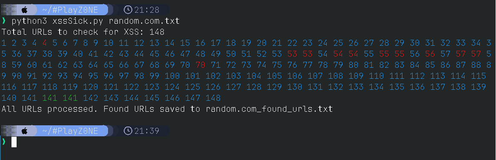

# xssSick

xssSick is a Python-based reflection point scanner for identifying potential Cross-Site Scripting (XSS) vulnerabilities. It reads a list of URLs, probes each parameter across multiple injection contexts, classifies where and how input is reflected, and injects blind payloads for stored/second-order cases — all without firing any actual exploits. The goal is clean, high-confidence signal that you manually follow up on.



## Table of Contents

- [Features](#features)
- [How It Works](#how-it-works)
- [Requirements](#requirements)
- [Installation](#installation)
- [Usage](#usage)
- [Output Files](#output-files)
- [Understanding Results](#understanding-results)
- [Contributing](#contributing)
- [License](#license)

---

## Features

- **Context-aware reflection detection** — classifies where your input lands: HTML body, HTML attribute, script block, HTML comment, JSON value, or CSS context.
- **5 probe types per parameter** — covers HTML body, JS double-quoted string, JS single-quoted string, unquoted attribute, and HTML comment contexts in separate requests.
- **All-params-simultaneous request** — fires one request with all parameters probed at once, catching cases that only reflect when multiple parameters interact.
- **Blind payload injection** — injects four payload variants (default, filter+CSP bypass, short polyglot, full polyglot) per parameter for stored/second-order XSS discovery. Callbacks traced via unique per-parameter IDs.
- **Header injection** — probes `Referer`, `User-Agent`, `X-Forwarded-For`, and `Accept-Language` for both reflection and blind injection.
- **WAF-neutral probes** — tokens are random lowercase alphanumeric strings with no suspicious keywords, minimising WAF signature matches.
- **4xx/5xx body scanning** — checks response bodies on error status codes, catching reflection in error pages.
- **Retry with exponential backoff** — retries network failures up to 3 times (2s → 5s → 15s). HTTP error responses are not retried.
- **Resume / checkpoint** — saves progress after every completed URL. Re-run the same command after a crash and it picks up where it left off.
- **Failed URL file** — URLs that exhaust all retries are written to a separate file in the same format as the input, so you can re-run it directly.
- **Structured JSON output** — findings include URL, parameter, probe type, reflection context, encoding status, confidence level, HTTP status, and content-type.
- **Concurrent workers** — configurable thread count for faster scanning of large URL lists.
- **Cookie and custom header support** — for scanning authenticated areas.

---

## How It Works

For each URL in your input file, xssSick runs three phases per parameter:

**Phase 1 — Reflection scanning**

A unique random token (e.g. `k9r2m`) is generated per request. The token is injected as part of a probe string designed for a specific context. If the token appears in the response, the surrounding characters are analysed to classify the reflection context. The scanner checks all HTTP responses including 4xx and 5xx, and follows redirect chains.

**Phase 2 — Blind injection**

Four blind payload variants are injected per parameter and fired silently (fire and forget). Each injection is logged with a unique per-parameter ID derived from a hash of the URL and parameter name. When your callback server (e.g. [XSS Hunter](https://xsshunter.com)) receives a hit, look up the ID in `domain_blind_log.json` to identify the exact URL and parameter that triggered it. If a 403 WAF block is detected, a filter+CSP bypass payload is added automatically.

**Phase 3 — Header injection**

The same probe and blind payloads are sent in common headers (`Referer`, `User-Agent`, `X-Forwarded-For`, `Accept-Language`) to catch cases where server-side code reflects header values.

---

## Requirements

- **Python 3.10+** (uses `match` is not required but `X | Y` type hints are used internally)
- **pip** packages: `requests`, `colorama` — see `requirements.txt`
- No external tools required. No browser, no headless driver, no Burp.

For blind payload callbacks you need a callback server. Recommended options:
- [XSS Hunter](https://xsshunter.com) — purpose-built, captures screenshot + DOM + cookies on callback
- [Interactsh](https://github.com/projectdiscovery/interactsh) — open source, self-hostable
- Burp Collaborator — if you have Burp Pro

Update the `X55.is` callback domain in `BLIND_PAYLOADS` inside `scanner.py` to your own server before running.

---

## Installation

1. Clone the repository:
   ```sh
   git clone https://github.com/ShrekBytes/xssSick.git
   ```

2. Navigate to the project directory:
   ```sh
   cd xssSick
   ```

3. Install dependencies:
   ```sh
   pip install -r requirements.txt
   ```

---

## Usage

### Basic

```sh
python3 scanner.py urls.txt
```

### With authentication (cookies)

```sh
python3 scanner.py urls.txt --cookie "session=abc123; user=xyz"
```

### With custom headers

```sh
python3 scanner.py urls.txt --header "Authorization: Bearer token123" --header "X-Custom: value"
```

### Faster scanning

```sh
python3 scanner.py urls.txt --threads 20 --delay 0.1
```

### Skip blind injection (reflection-only mode)

```sh
python3 scanner.py urls.txt --no-blind --no-headers
```

### Resume after crash or interruption

```sh
python3 scanner.py urls.txt --resume
```
Checkpoint is auto-detected — the `--resume` flag is optional if the `.checkpoint` file exists.

### Re-run failed URLs

```sh
python3 scanner.py domain_failed.txt
```
The failed file is in the same format as the original input. Just pass it directly — no special flags needed.

### All options

```
positional arguments:
  file                  Text file with one URL per line

options:
  --cookie COOKIE       Cookie header e.g. "session=abc; user=xyz"
  --header NAME:VALUE   Extra request header (repeatable)
  --threads N           Concurrent workers (default: 5)
  --timeout N           Request timeout in seconds (default: 23)
  --delay N             Delay between requests per worker (default: 0.25s)
  --user-agent UA       Custom User-Agent string
  --no-blind            Skip blind payload injection
  --no-headers          Skip header injection phase
  --resume              Resume from checkpoint
  --verbose             Debug-level logging
```

---

## Output Files

| File | Contents |
|---|---|
| `domain_findings.json` | All reflection hits with full context |
| `domain_blind_log.json` | All blind injections sent — look up callback IDs here |
| `domain_failed.txt` | URLs that failed after all retries — re-run this file |
| `domain_errors.txt` | URLs that returned 4xx/5xx — worth reviewing for WAF blocks |
| `domain.checkpoint` | Resume state — deleted automatically on clean finish |

The domain prefix is derived from the input filename. Running `scanner.py example.com_urls.txt` produces `example.com_urls_findings.json`, etc.

---

## Understanding Results

### Confidence levels

| Level | Meaning |
|---|---|
| `high` | Token reflected raw in HTML body or attribute — strong candidate |
| `medium` | Token reflected raw in JS block, JSON value, or HTML comment |
| `low` | Token reflected but structural characters are encoded — filter present |
| `partial` | Token truncated in output — possible length limit, still worth checking |

### Reflection contexts

| Context | What it means |
|---|---|
| `html_body` | Reflected directly in page content |
| `html_attribute` | Reflected inside a tag attribute value |
| `script_block` | Reflected inside a `<script>` block or JS variable |
| `html_comment` | Reflected inside an HTML comment |
| `json_value` | Reflected in a JSON API response |
| `css_value` | Reflected inside a CSS style context |

### Blind log — tracing callbacks

When your callback server receives a hit with an ID like `a3f9c1b2`, open `domain_blind_log.json` and search for that ID:

```json
{
  "url": "https://example.com/contact?name=...",
  "param": "name",
  "blind_id": "a3f9c1b2",
  "payload_type": "full_polyglot",
  "callback_url": "https://your-callback-server.com?id=a3f9c1b2",
  "timestamp": "2026-03-15T14:32:05"
}
```

This tells you the exact URL, parameter, and payload type that triggered the callback. Keep your callback server running for at least 2–4 weeks after a scan — admin callbacks can arrive days later.

---

## Testing

A test suite and a local mock server are included to verify all detection cases:

```sh
python3 test_scanner.py
```

This starts a local HTTP server that simulates every reflection scenario (HTML body, attribute, script block, comment, JSON, encoded, partial, redirect, 500 body, multi-param interaction, header reflection) and runs 72 automated checks across all scanner components.

---

## Contributing

Feel free to submit issues or pull requests for suggestions, improvements, or bug reports. Contributions are appreciated.

---

## License

"License? Nah, who needs those bothersome regulations anyway? Feel free to do whatever you want with this code – use it as a doorstop, launch it into space, or frame it as a modern art masterpiece. Just don't blame me if things get a little wild!"

---

*By using this tool you agree it is for authorised security testing only. Always obtain explicit written permission before scanning any target. Misuse of this tool can lead to serious legal consequences.*
