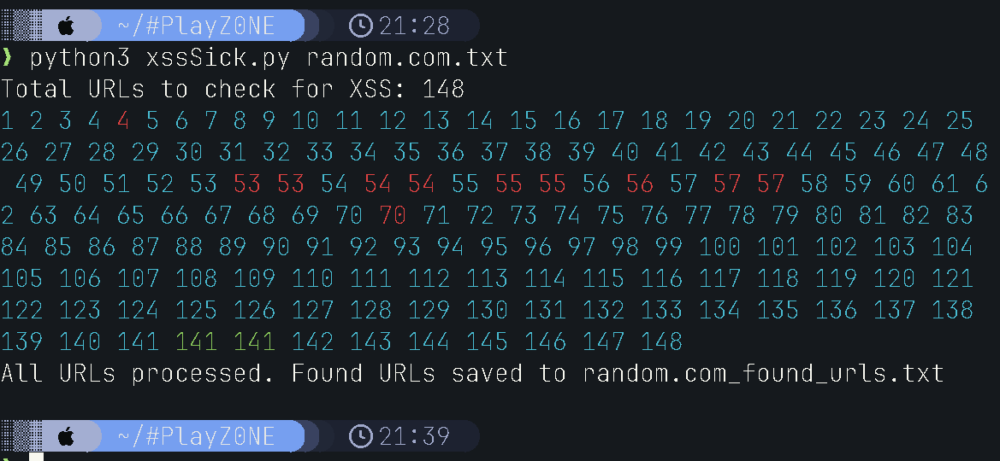

# xssSick

xssSick is a Python script for identifying potential Cross-Site Scripting (XSS) vulnerabilities. It reads URLs from a file, modifies each URL's parameters with a gibberish value containing brackets and signs, and searches the response for reflections and matches. Found URLs are saved to an output file.



## Table of Contents

- [Features](#features)
- [Requirements](#requirements)
- [Installation](#installation)
- [Usage](#usage)
- [Contributing](#contributing)
- [License](#license)
- 
## Features

- Reads URLs from a file.
- Modifies each URL's parameters with a specific test value containing brackets and signs.
- Sends HTTP requests to the modified URLs.
- Searches the response source code for specific words and signs that indicate XSS possibilities.
- Saves the URLs where matches are found to an output file.
- Displays output in the terminal: `blue` for processed URLs, `red` for unreachable URLs, and `green` for matches (XSS) found.
- Experimental (must be enabled manually): Detects DOM XSS (uncomment `dom_possible` function definition and calls).

## Requirements

- Python 3.x
- `requests` library
- `colorama` library

## Installation

1. Clone the repository:
   ```sh
   git clone https://github.com/yourusername/xssSick.git
   ```
2. Navigate to the project directory:
   ```sh
   cd xssSick
   ```
3. Install the required Python libraries:
   ```sh
   pip install -r requirements.txt
   ```

## Usage

1. Run the script:
   ```sh
   python3 xssSick.py example.com.txt
   ```

2. The script will process each URL and save the results to an output file named `<domain>_found_urls.txt` (e.g., `example_found_urls.txt`).

## Contributing

Feel free to submit issues or pull requests for suggestions, improvements, or bug reports. Your contributions are appreciated!

## License

"License? Nah, who needs those bothersome regulations anyway? Feel free to do whatever you want with this code – use it as a doorstop, launch it into space, or frame it as a modern art masterpiece. Just don't blame me if things get a little wild!"

---

By using this script, you agree that it is for educational purposes only and you have permission to test the URLs you provide. Misuse of this tool can lead to serious consequences. Always obtain proper authorization before testing.
